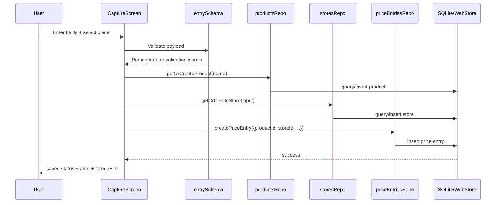
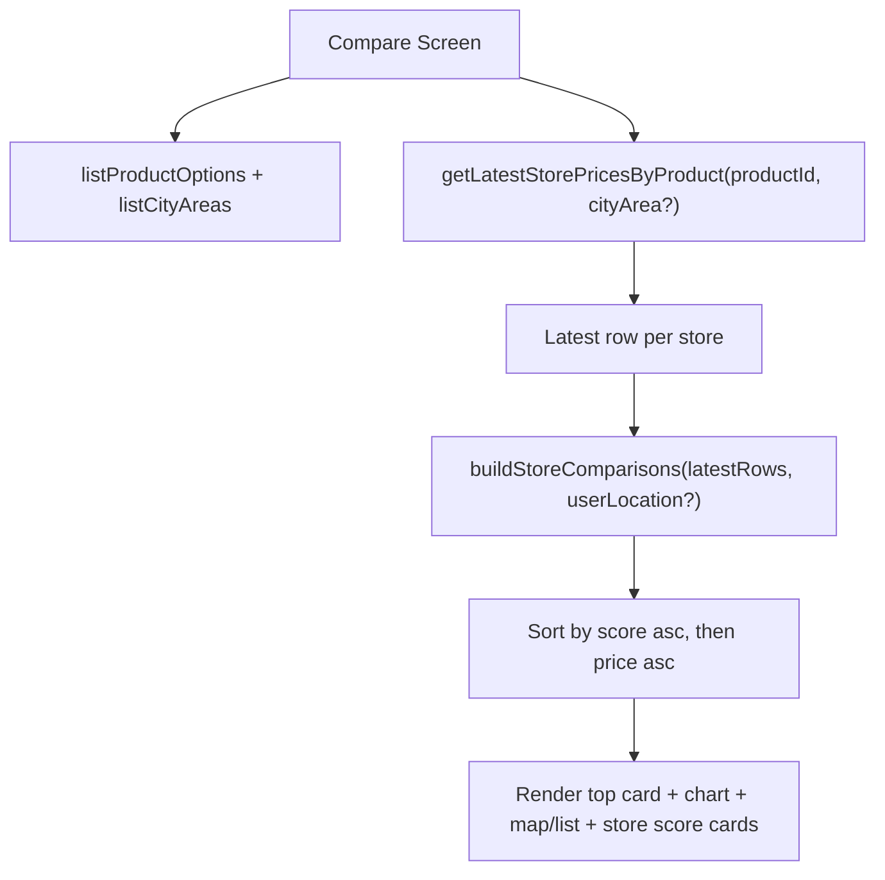

# Architecture Overview

## Architectural Style
The app uses a local-first, layered client architecture:
- `app/*` screens orchestrate user flows.
- `src/components/*` provides reusable presentational pieces.
- `src/services/*` contains business logic and external capability adapters.
- `src/db/repositories/*` provides data access contracts.
- `src/db/*` provides storage runtime (SQLite native, local web store fallback).
- `src/state/*`, `src/i18n/*`, and `src/theme/*` provide cross-cutting UI state/localization/tokens.

## Runtime Stack
- React Native + Expo Router (tab-based app shell).
- TypeScript with strict mode (`tsconfig.json`).
- `expo-sqlite` for native persistence.
- `expo-location` for current location and reverse geocoding.
- Google Places HTTP API (optional, key-gated).
- `zustand` for cross-screen filter state.

## Layer Responsibilities
### Screens (`app/*.tsx`)
- Compose components and call repositories/services.
- Hold screen-local UI state.
- Own view states (loading, empty, error, success).

### Components (`src/components/*`)
- Render reusable UI blocks (`FilterChip`, `StoreScoreCard`, `PriceBarChart`).
- Provide platform-specific variants where needed (`*.native.tsx`, `*.web.tsx`).

### Services (`src/services/*`)
- `rankingService`: distance calculation and ranking score model.
- `locationService`: permission, location capture, reverse geocode area/address.
- `placesService`: search/details requests + pin-only fallback behavior.

### Repositories (`src/db/repositories/*`)
- `productsRepo`: normalized product identity and option queries.
- `storesRepo`: store identity dedupe and city-area queries.
- `priceEntriesRepo`: inserts, latest-store selection, and history retrieval.

### Storage (`src/db/*`)
- Native: SQLite DB with migrations and indexes.
- Web: `localStorage` JSON store + in-memory fallback if browser storage is unavailable.

## Platform Split Model
TypeScript resolves platform implementations via `moduleSuffixes`:
- Native-first file resolution: `.native` before `.web` before base file.
- Current split components:
- `PlacePickerModal.native.tsx` vs `PlacePickerModal.web.tsx`
- `StoreMap.native.tsx` vs `StoreMap.web.tsx`
- `ObservedDateInput.native.tsx` vs `ObservedDateInput.web.tsx`

Rules for split implementations:
- Keep prop contracts equivalent across variants.
- Keep output semantics equivalent even when UX differs (for example, interactive map on native vs list summary on web).

## Startup / Bootstrap Sequence
`app/index.tsx` redirects to `/compare`, while `app/_layout.tsx` gates tab rendering behind startup readiness.

Bootstrap behavior in `app/_layout.tsx`:
1. Run `runMigrations()`.
2. Enforce timeout fail-fast at 12 seconds.
3. Show loading gradient screen while pending.
4. Show error/retry state on failure.
5. Render tabs only after successful initialization.

Notes:
- On web, migrations are skipped (`runMigrations` returns early).
- Tab shell includes `capture`, `compare`, and `history` screens; `index` route is hidden from tab bar.

## Data Flow: Capture to Persistence

## Data Flow: Compare Ranking

## Cross-Cutting Concerns
- Localization: translation keys in `src/i18n/translations.ts`, runtime select in `useI18n`.
- Styling: centralized token set in `src/theme/tokens.ts`.
- Shared filters: `useFiltersStore` synchronizes selected product/store/area behavior across screens.

## Related Pages
- [Domain Model and Data Lifecycle](./Domain-Model-and-Data-Lifecycle.md)
- [Database and Repositories](./Database-and-Repositories.md)
- [Developer Rules and Engineering Standards](./Developer-Rules-and-Engineering-Standards.md)
