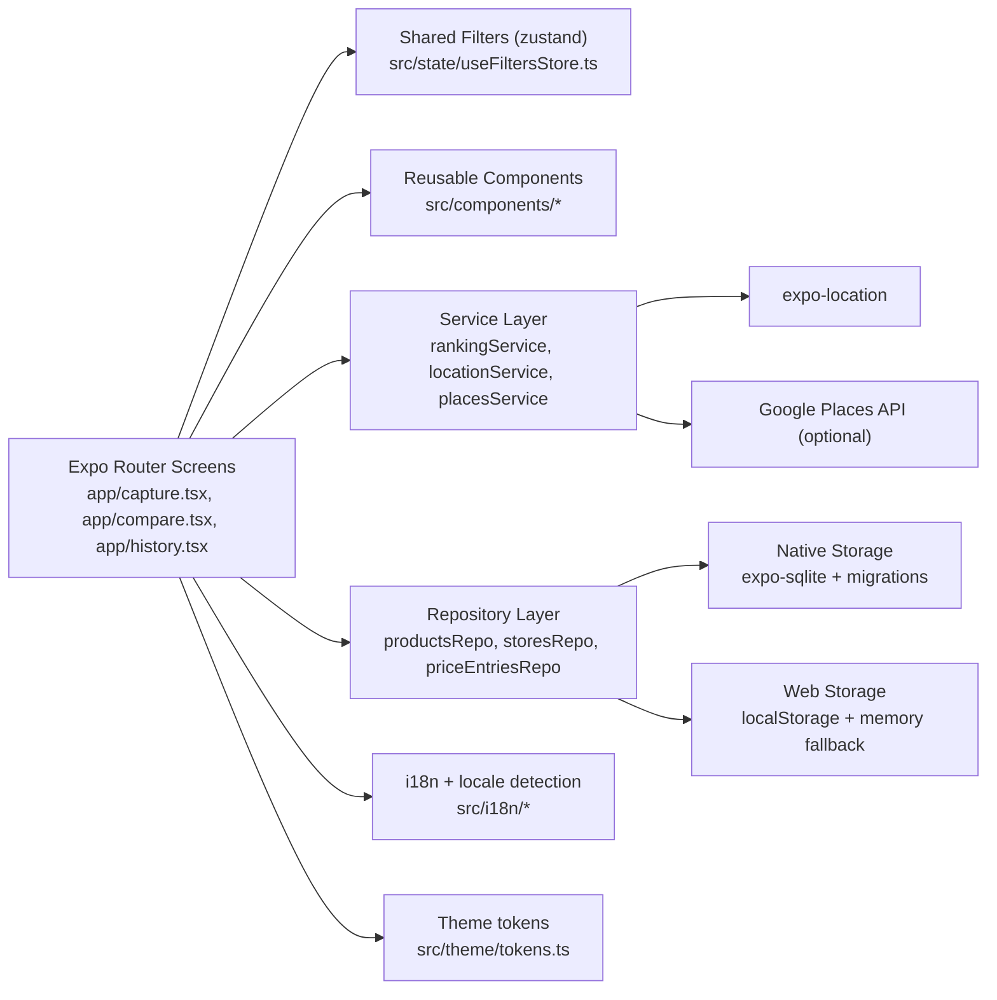

# Japan Price Tracker Wiki

This wiki is the developer-facing source of truth for how the app works, how to change it safely, and how to ship with confidence.

## Purpose
- Build a fast, reliable field-capture app for product prices in Japan.
- Help users decide where to buy using latest price data and optional distance context.
- Keep architecture simple: Expo Router screens, service/repository layers, and local-first storage.

## Target User
- Traveler or shopper moving between stores and recording prices quickly.
- User who wants quick buy decisions from current observations, not long-term market analytics.

## Core Value Proposition
- Capture a price entry in seconds with map-backed location data.
- Compare latest prices across stores and rank options with a deterministic scoring model.
- Review timeline history with product and store filters.

## Non-Goals
- No cloud sync or multi-device account model.
- No server-side APIs; storage is local (`SQLite` on native, `localStorage`/memory on web).
- No checkout, payment, or merchant integrations.
- No advanced forecasting or trend prediction model.

## Start Here (New Developers)
1. Read [Architecture Overview](./Architecture-Overview.md).
2. Read [Developer Rules and Engineering Standards](./Developer-Rules-and-Engineering-Standards.md).
3. Run locally using steps in [Release Runbook and Troubleshooting](./Release-Runbook-and-Troubleshooting.md).
4. Use [Testing, QA, and Regression Checklist](./Testing-QA-and-Regression-Checklist.md) before opening a PR.

## App Workflow Map
- `Capture`: create product/store/price observations with map-selected location and date.
- `Compare`: load latest price per store for selected product and rank by price + distance.
- `History`: inspect chronological entries with product/store filters.

## System Overview

## Wiki Index
- [Architecture Overview](./Architecture-Overview.md)
- [Domain Model and Data Lifecycle](./Domain-Model-and-Data-Lifecycle.md)
- [Database and Repositories](./Database-and-Repositories.md)
- [Screen Flows and UX States](./Screen-Flows-and-UX-States.md)
- [Location, Maps, and Places Integration](./Location-Maps-and-Places-Integration.md)
- [Ranking Engine and Decision Logic](./Ranking-Engine-and-Decision-Logic.md)
- [State, i18n, and Platform Variants](./State-I18n-and-Platform-Variants.md)
- [AI Agent Component Development Playbook](./AI-Agent-Component-Development-Playbook.md)
- [Developer Rules and Engineering Standards](./Developer-Rules-and-Engineering-Standards.md)
- [Testing, QA, and Regression Checklist](./Testing-QA-and-Regression-Checklist.md)
- [Release Runbook and Troubleshooting](./Release-Runbook-and-Troubleshooting.md)
- [Contributing Workflow](./Contributing-Workflow.md)
- [Glossary](./Glossary.md)
- [GitHub Wiki Publish Guide](./GitHub-Wiki-Publish-Guide.md)

## Related Pages
- [Architecture Overview](./Architecture-Overview.md)
- [Developer Rules and Engineering Standards](./Developer-Rules-and-Engineering-Standards.md)
- [Contributing Workflow](./Contributing-Workflow.md)
